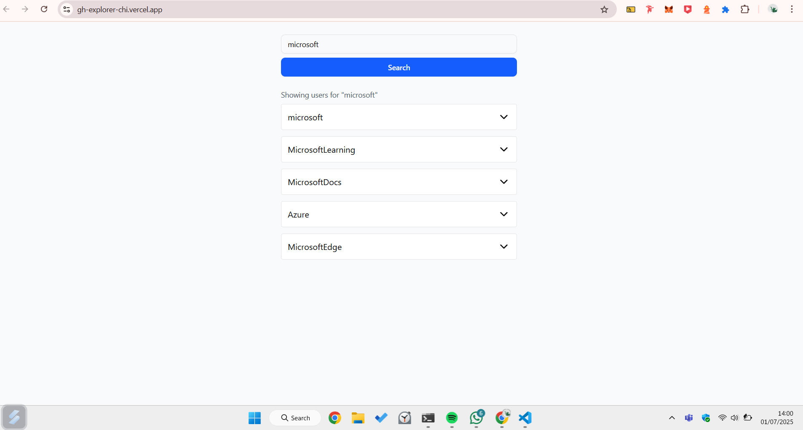
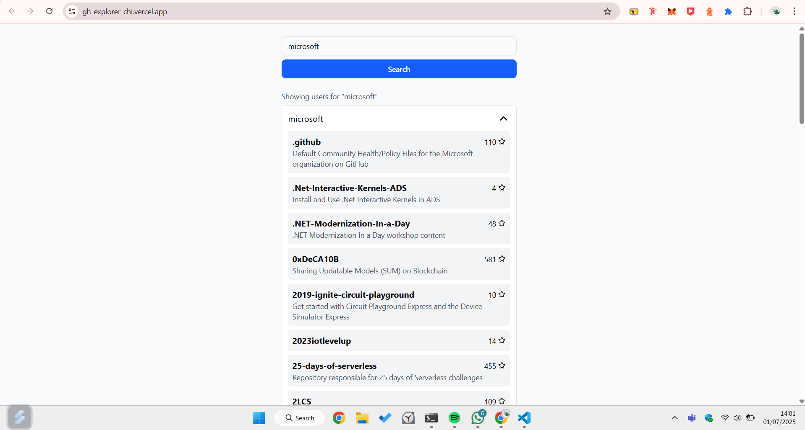

# 🚀 GitHub Repositories Explorer

A sleek, responsive web application built with React + TypeScript to explore GitHub users and their public repositories. Search for up to 5 users by username and expand to view their repositories — all with a clean UI and great UX.

> ✅ Created for a React developer recruitment task
> ✅ Live Demo available (see below)

---

## 🔗 Live Demo

🌍 [https://gh-explorer-chi.vercel.app](https://gh-explorer-chi.vercel.app)

---

## 📸 Screenshots

| Search View | Expanded User |
|-------------|----------------|
|  |  |

---

## 🎯 Features

- 🔎 Search GitHub users by username
- ⬇️ Show top 5 matching results
- 📦 Expand user to reveal public repositories
- 🌟 Display repo name, description & star count
- 🧼 Clean UI with **shadcn/ui**
- 💬 All text in English
- 📱 Fully responsive design (mobile-friendly)
- 🔁 Centralized state with **Redux Toolkit**
- ⚡ API integration with **RTK Query**
- 🧪 Fully tested with **Vitest** & **React Testing Library**
- 📦 Public repository & deployed via Vercel

---

## 🧱 Tech Stack

| Layer      | Stack                                |
|------------|--------------------------------------|
| Frontend   | React, TypeScript, Vite              |
| Styling    | Tailwind CSS, shadcn/ui              |
| State      | Redux Toolkit, RTK Query             |
| Testing    | Vitest, Testing Library              |
| Deployment | Vercel                               |

---

## 🛠️ Getting Started

### 1. Clone the repository

```bash
git clone https://github.com/artechspirit/gh-explorer.git
cd gh-explorer
```

### 2. Install dependencies

```bash
npm install
```

### 3. Add environment variables

Create a `.env` file in the root of the project and add your GitHub personal access token:

```env
VITE_GITHUB_TOKEN=your-github-token
```

### 4. Start development

```bash
npm run dev
```

Then open: [http://localhost:5173](http://localhost:5173)

---

## ✅ Running Tests

Run all tests:

```bash
npm run test
```

---


## 📂 Folder Structure

```
src/
├── components/         # UI components (SearchBar, UserCard)
├── features/           # Redux slice for search state
├── services/           # GitHub API via RTK Query
├── test/               # test setup
├── hooks.ts            # Typed Redux hooks
├── store.ts            # Redux store
├── App.tsx             # Root component
└── main.tsx            # App entrypoint
```

---

## ✍️ Author

**Beta Priyoko**  
📧 artechspirit@gmail.com  
🔗 [https://github.com/artechspirit](https://github.com/artechspirit)

---

## 📄 License

This project is licensed under the [MIT License](LICENSE)

---

## 🙏 Acknowledgements

- [GitHub REST API](https://docs.github.com/en/rest)
- [shadcn/ui](https://ui.shadcn.com/)
- [Redux Toolkit](https://redux-toolkit.js.org/)
- [Vitest](https://vitest.dev/)
